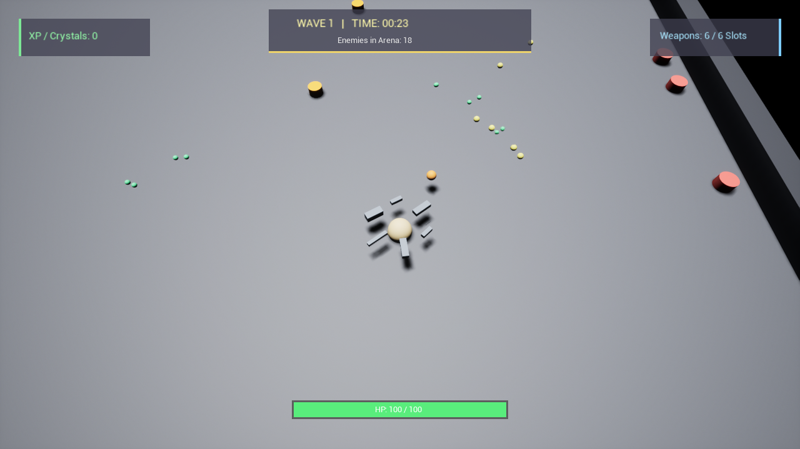
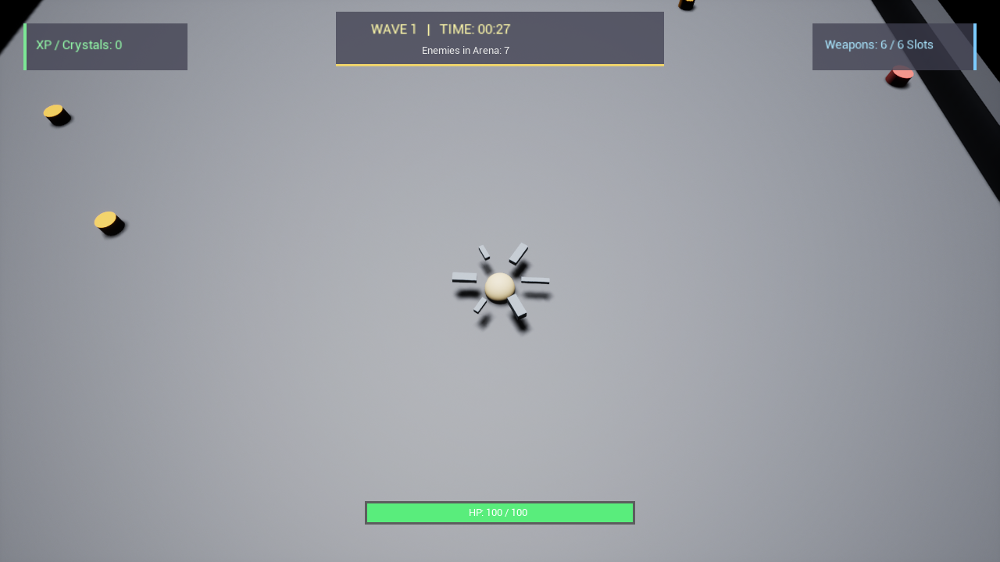

# Mini Brotato 3D (迷你土豆 3D)

<div align="center">


**商业级 3D 俯视角动作肉鸽射击游戏 (Commercial 3D Action Roguelite Arena Shooter)**

*从 2D Pygame 原型跃升为虚幻引擎 5 (Unreal Engine 5.8) 商业化独立游戏*

</div>

---

## 📸 实机战斗截图 (In-Engine Gameplay)

### 波次中段：六武器环绕自动索敌与群怪围剿


### 波次开局：土豆英雄全武装挂载与边界怪潮初现


---

## 🌟 核心特色 (Core Features)

- **🥔 六武器环绕武装系统 (6 Orbiting Concurrent Weapons)**
  - 玩家角色身周环绕 6 个等角自转武器插槽 (`OrbitSpeed = 25°/s`)。
  - 每把武器具备独立的有效扫描射程与射击朝向插值，实现 360° 全向高频索敌齐射。
  - 包含手枪 (Pistol)、霰弹枪 (Shotgun)、穿透步枪 (Rifle)、追踪发射器 (Launcher) 四大派系。
- **📊 20 维 RPG 深度属性体系 (20-Dimensional Attribute Depth)**
  - 完整复刻并升维 Brotato 经典底层数值计算：包含最大生命值、护甲非线性减伤公式（$Damage / (1 + Armor \times 0.066)$）、闪避率、暴击倍率、吸血率、拾取半径与收获 (Harvesting)。
- **👾 高同屏群怪 AI 优化 (Kinematic Swarm Steering)**
  - 针对幸存者类游戏核心体验进行性能专属调优：关闭重型物理模拟与消耗巨大的 Lumen/VSM，采用运动学向量解算；
  - 轻松支持 100~300+ 怪物同屏移动与围剿，低配 PC 与 Steam Deck 稳定 60+ FPS。
  - 细分怪种行为：普通怪 (Walker)、高危蓄力冲锋怪 (Dasher)、首领精英 (Boss)。
- **💎 晶体经济与磁力吸附 (Magnetic Crystal Economy)**
  - 击杀敌人掉落高饱和荧光经验晶体，玩家接近后触发磁力加速度吸收，实时回馈成长收益。
- **⏱️ 紧凑刺激的波次生存循环 (Wave Survival Loop)**
  - 30 秒单波紧张生存计时，四方边界动态怪潮涌动。
- **🖥️ 实时高可视 Canvas HUD**
  - 顶部波次倒计时、场内存活敌人计数、底部动态生命槽、左上经验晶体统计与右上武器槽位指示。

---

## 📂 源码架构 (Architecture)

```
C:\UEProjects\Brotato3D\
├── Brotato3D.uproject              // UE 5.8 独立工程配置
├── Config/                         // 渲染、输入、手柄映射配置
│   ├── DefaultEngine.ini
│   ├── DefaultGame.ini
│   └── DefaultInput.ini
├── Source/Brotato3D/               // C++ 核心源码
│   ├── Character/
│   │   ├── B3DCharacter.h / .cpp   // 3D 俯视角英雄、6武器挂载槽位、输入驱动
│   ├── Weapon/
│   │   ├── B3DWeaponBase.h / .cpp  // 武器基类、自锁敌、后坐力回弹
│   │   └── B3DProjectile.h / .cpp  // 弹道动力学、贯穿、反弹、引导追踪
│   ├── Enemy/
│   │   └── B3DEnemyBase.h / .cpp   // 群怪基类、冲锋蓄力机制、受击击退与掉落
│   ├── Item/
│   │   └── B3DDropMaterial.h / .cpp// 经验晶体、磁力吸引与拾取判定
│   ├── Core/
│   │   ├── B3DTypes.h              // 20维属性结构体、武器/敌人枚举
│   │   ├── B3DAttributeComponent.h // 护甲计算、闪避、吸血与数值状态
│   │   └── B3DGameMode.h / .cpp    // 过程化40m竞技场生成、波次倒计时、怪潮生成机
│   └── UI/
│       └── B3DHUD.h / .cpp         // 即时战斗 Canvas HUD 渲染
├── Scripts/                        // 工程自动化工具集
│   ├── Build.ps1                   // 一键极速编译脚本 (7~14秒)
│   └── PlayQA.ps1                  // 自动化实机战斗冒烟测试与截图遥测
├── Docs/Screenshots/               // 实机高清展示切片
└── LegacyPrototype/                // 原 2D Pygame 历史原型归档 (保留历史与致敬)
```

---

## 🚀 编译与运行 (Build & Run)

### 环境要求
- Windows 10/11 64-bit
- Unreal Engine 5.8
- Visual Studio 2022 (MSVC v143 toolchain)
- 虚幻引擎内置 .NET 10.0 SDK

### 1. 一键编译
在项目根目录下运行 PowerShell：
```powershell
powershell -ExecutionPolicy Bypass -File .\Scripts\Build.ps1
```
> 借助 UBA (Unreal Build Accelerator) 与预编译头优化，增量编译可在 7 秒内完成。

### 2. 自动化实机测试与运行
运行自动化 QA 脚本，启动独立游戏窗口并执行 18 秒战斗切片验证：
```powershell
powershell -ExecutionPolicy Bypass -File .\Scripts\PlayQA.ps1
```
测试完成后将自动捕获战斗实机画面并输出性能遥测日志。

---

## 🗺️ 商业化路线图 (Roadmap to Steam)

- [x] **Phase 1: 核心可玩战斗切片 (MVP Combat Slice)**
  - 6 武器并发环绕自锁敌
  - 20 维 RPG 属性体系与受击击退
  - 轻量化怪潮追逐与 Dasher 冲锋 AI
  - 经验晶体磁吸与波次计时器
- [ ] **Phase 2: 波间 3D 商店与数值升阶 (Shop & Fusion)**
  - 30s 局间卡牌商店（买武器、道具、重随 Reroll、锁定 Lock）
  - 经典 2 合 1 武器升阶系统（白 -> 蓝 -> 紫 -> 橙）
  - 首批 4 位特色土豆职业（全能者、狂战士、游侠、法师）
- [ ] **Phase 3: 美术资产升级与果汁打击感 (Juice & Art)**
  - 风格化低多边形 3D 角色模型与怪物动画替换
  - Niagara 激光、爆炸与碎屑粒子
  - Hit-Stop 顿帧、屏幕微震与 3D 动态飘字
- [ ] **Phase 4: Steamworks 商业化与掌机适配 (Steam Deck)**
  - Steamworks SDK 集成（成就、云存档、统计）
  - 全手柄操作原生适配（达到 Steam Deck Verified 标准）
  - 多语言本地化（中/英/日/韩/西等）

---

## 📜 开源许可 (License)
本项目基于 [MIT License](LICENSE) 开源。原 Pygame 2D 原型已归档于 `LegacyPrototype/` 目录中。
